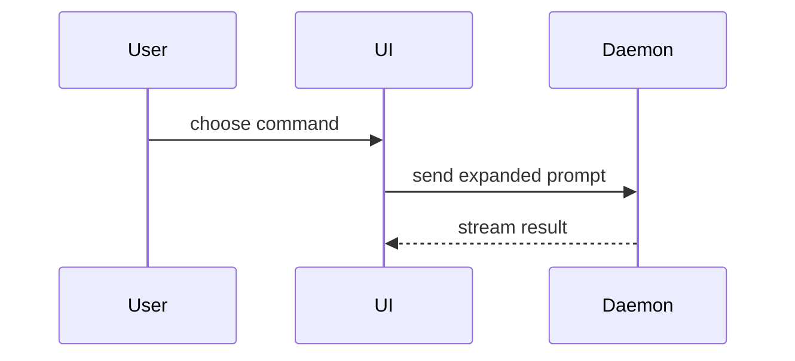

# Write PR body

Write the PR body from the actual change. Skip all preambles and keep prose brief. Use the user's domain language from `CONTEXT.md`.

## Workflow

1. Inspect the change: `git log` and `git diff` against the base branch, not only the latest commit.
2. Check for a template: `.github/PULL_REQUEST_TEMPLATE.md`, `.github/PULL_REQUEST_TEMPLATE/*.md`, or `PULL_REQUEST_TEMPLATE.md` at the repo root. If several exist, use the default or the one the user named.
3. If a template exists, keep its headings. Fill those sections with the same idea: a visual for what changed, and before-after evidence for how you know it works. Do not invent other sections. If the template has no test or verification section, add Evidence.
4. If no template exists, use the fallback body below.
5. Return the filled body. Do not open a pull request.

## Fallback body

```markdown
## Summary

<diagram, diff-sketch, or tree>

## Evidence

- **Before:** <screenshot/output/failing test run>
  **After:** <screenshot/output/passing test run>
```

## How to show

Pick the smallest view that makes the key point clear. Put it in the summary-like section of the template, whatever that section is named.

- Show logic or an algorithm as pseudocode:

```text
on(save)
  if content is unchanged
    return cached result
  write new content
  return fresh result
```

- Show runtime control flow as a call tree:

```text
submitForm
  createSession
    persistPrompt
    launchAgent
  navigateToSession
```

- Show UI structure as a component tree, including state and module boundaries that matter:

```tsx
<SessionPage> (apps/example/src/routes/session.tsx)
  useSessionEvents()
  <SessionToolbar>
    <RunSkillButton> (packages/ui)
```

- Show file responsibility or a broad refactor as a shallow file tree:

```text
src/
|-- commands/       # parses user actions
|-- sessions/       # owns session state
`-- transport/      # sends API requests
```

- Show component interaction, control flow, or data flow with Mermaid:



- Use `diff` when the point is what changes and the surrounding shape already exists. Match the diff shape to the topic.

For a component change:

```diff
 <SessionPage>
   useSessionEvents()
   <SessionToolbar>
+    <RunSkillButton />
   <SessionTimeline>
+    <SkillResultCard />
```

For a file-layout change:

```diff
 src/
 |-- commands/
+|   `-- show-me.ts       # expands the slash command
 |-- sessions/
-`-- transport.ts
+`-- transport/
+    |-- client.ts
+    `-- stream.ts
```

For a call-tree or call-stack change:

```diff
 submitForm
   createSession
     persistPrompt
+    expandSkillMention
     launchAgent
-  navigateToSession
+  navigateToSession
+    subscribeToEvents
```

For a state or control-flow change:

```diff
 on(save)
-  write content
+  if content is unchanged
+    return cached result
+  write new content
+  invalidate cache
```

- Show the whole block when most of it is new, when omitted context would hide ownership or order, or when the user needs a copyable target shape:

```ts
function expandSkill(command: string): string {
  const skillName = command.slice(1);
  return `use the ${skillName} skill`;
}
```

### Guidance

Place each visual next to the short text it supports. Keep only the calls, files, props, states, and boundaries needed to answer the current question.

You may use one of these, you may use several, it is unlikely you will use all of them. Use your judgement and do not overwhelm the user.

## Evidence

Concrete evidence that the change works. Show a before and after. Put it in the template's test or verification section when one exists. Otherwise use Evidence.

Screenshots are S-tier - when the environment is set up for it and the change is visual.

Execution-based evidence is A-tier. Test results, console output. Show the exact test that now fails and passes, using pseudocode.

## Scope

- Read-only. Never runs `gh pr create` or anything that publishes.
- General purpose for any repository.

## Validation

- A template, when present, kept its headings.
- The body has a visual for what changed and a before-after for what was verified.
- Every visual traces to the actual diff.
- Nothing was published.
